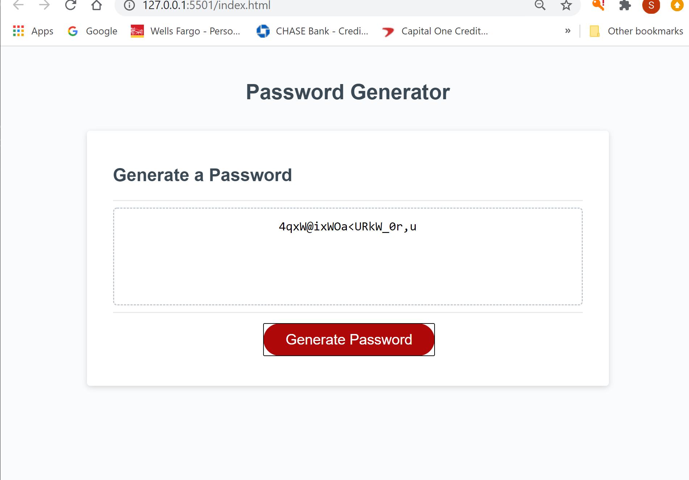

# PassGen

Secure, Random Password Generator

\*\*This is a Random Password Generator that will take any amount you choose,
between 8 and 128, then will randomly generate a random string of characters equal
to the chosen length by User.
The special choice selection will include the following four choices:
Uppercase, Lowercase, Numbers and Special Characters.

Includes:
#index.html
#script.js
#styles.css
This Readme

References:

https://sterlingorth.github.io/PassGen/
https://github.com/SterlingOrth/PassGen.git

